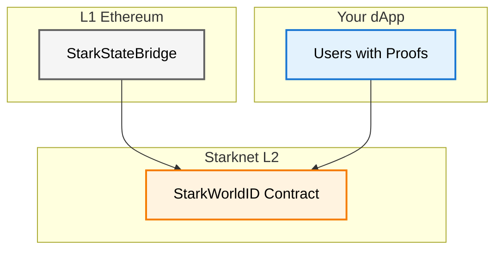

# L2 Components

The L2 component serves as the execution layer for World ID's identity verification infrastructure on Starknet, centered around the `StarkWorldID` contract. This sophisticated identity management system receives and validates World ID merkle tree roots from Ethereum, enabling native zero-knowledge proof verification directly within Starknet's execution environment.

By maintaining synchronized state with Worldcoin's canonical identity system while leveraging Starknet's computational advantages, the L2 component provides developers with efficient, cost-effective access to World ID's proof-of-personhood capabilities. The architecture implements advanced cryptographic verification through Garaga's optimized proof systems, ensuring that identity verification maintains the same security guarantees as Ethereum while benefiting from Starknet's enhanced scalability.

## Architecture



## StarkWorldID Contract

The `StarkWorldID` contract represents the authoritative identity verification system on Starknet, implementing a sophisticated state management architecture that bridges Ethereum's World ID infrastructure with Starknet's execution capabilities. This contract combines the `WorldID` component for identity verification logic with the `CrossDomainOwnable` component for secure cross-chain administration, creating a robust foundation for decentralized identity operations.

The contract's design prioritizes both security and developer accessibility—while administrative functions maintain strict cross-domain authorization, the core verification capabilities remain openly accessible, enabling any application to leverage World ID's proof-of-personhood guarantees within their smart contract logic.

### Storage Layout

The contract maintains critical state information optimized for both security and operational efficiency:

- **Tree depth**: Immutable configuration set during initialization, supporting depths between 16-32 levels to accommodate different identity tree sizing requirements
- **Latest root**: The most recently received merkle tree root from L1, serving as the canonical reference for current identity state
- **Root history**: Comprehensive mapping of historical roots with their reception timestamps, enabling flexible proof verification windows
- **Root expiry**: Configurable duration defining how long historical roots remain valid for verification, balancing security with user experience

## External Functions

These functions provide the primary interface for integrating World ID verification into your Starknet applications:

### `require_valid_root(root: u256)`

```cairo
fn require_valid_root(self: @ComponentState<TContractState>, root: u256)
```

Validates whether a provided merkle tree root is acceptable for identity verification within your application. The function implements intelligent temporal validation—accepting the latest root immediately while applying expiration checks to historical roots. This ensures that user-generated proofs remain valid within reasonable time windows while preventing potential replay attacks using stale identity commitments.

### `latest_root() -> u256`

```cairo
fn latest_root(self: @ComponentState<TContractState>) -> u256
```

Retrieves the most recently synchronized identity merkle tree root from the L1 World ID system. This function serves as your primary interface for obtaining the current canonical state of the global identity tree, enabling your application to verify proofs against the most up-to-date identity commitments.

### `verify_groth16_proof_bn254(full_proof_with_hints: Span<felt252>) -> Option<Span<u256>>`

```cairo
fn verify_groth16_proof_bn254(self: @ComponentState<TContractState>, full_proof_with_hints: Span<felt252>) -> Option<Span<u256>>
```

Executes comprehensive zero-knowledge proof verification using Garaga's optimized BN254 curve operations. This function processes Groth16 proofs containing the complete World ID verification data: merkle tree root, nullifier hash, signal hash, and external nullifier hash. The verification process validates both the cryptographic integrity of the proof and ensures the referenced root exists within the contract's accepted history, providing robust protection against fraudulent identity claims.

### `root_history_expiry() -> felt252`

```cairo
fn root_history_expiry(self: @ComponentState<TContractState>) -> felt252
```

Returns the configured expiration duration for historical roots in seconds. This information helps your application understand the temporal validity window for user proofs and implement appropriate user experience flows around proof generation timing.

### `get_tree_depth() -> u8`

```cairo
fn get_tree_depth(self: @ComponentState<TContractState>) -> u8
```

Provides the immutable tree depth configuration, which is essential for understanding the cryptographic parameters of the identity system and ensuring compatibility with proof generation libraries.

## Cross-Domain Administration

These functions handle the secure reception of updates from the authorized L1 bridge contract, maintaining the integrity of the cross-chain identity synchronization:

### Root Synchronization

The contract receives new identity roots through secure cross-domain messaging from the L1 StarkStateBridge. This process validates message authenticity, prevents root overwrites to maintain historical integrity, and updates the contract's state to reflect the latest global identity tree configuration.

### Configuration Management

Administrative updates to root expiration policies and ownership transitions are handled through authenticated cross-domain messages, ensuring that governance decisions made on Ethereum are properly reflected in the Starknet contract's operational parameters.

## Events and Monitoring

The contract provides comprehensive event emission for monitoring identity system operations:

### Identity System Events

```cairo
event RootAdded {
    #[key]
    root: u256,
    timestamp: u128,
}
```
Emitted when a new identity root is successfully received and stored from L1. Monitor this event to track when new identity commitments become available for proof verification in your application.

```cairo
event RootHistoryExpirySet {
    #[key]
    new_expiry: felt252,
}
```
Triggered when the root expiration policy is modified through cross-domain governance. This event helps you understand changes to the temporal validity windows that affect user proof lifetimes.

## Error Handling

The contract implements precise error conditions that provide clear diagnostic information for both development and production environments:

- **ExpiredRoot**: The merkle tree root referenced in a verification attempt has exceeded its configured validity window
- **NonExistentRoot**: The provided root does not exist in the contract's historical record, indicating either an invalid proof or synchronization issues
- **NoRootsSeen**: The bridge has not yet received any roots from L1, typically occurring only during initial deployment phases
- **UnsupportedTreeDepth**: Initialization attempted with a tree depth outside the supported range (16-32 levels)
- **CannotOverwriteRoot**: Prevention of duplicate root submissions that could compromise historical integrity

## Integration Guide

To integrate World ID verification into your Starknet application:

### Basic Verification Flow

1. **Obtain Current Root**: Call `latest_root()` to get the merkle tree root for proof generation
2. **Generate Proof**: Use World ID client libraries to generate proofs against this root
3. **Verify On-Chain**: Call `verify_groth16_proof_bn254()` with the generated proof data
4. **Handle Results**: Process successful verification or handle specific error conditions

### Advanced Integration Patterns

- **Root Monitoring**: Subscribe to `RootAdded` events to understand when new identity states become available
- **Proof Lifetime Management**: Use `root_history_expiry()` to implement user-friendly proof generation timing
- **Error Recovery**: Implement graceful handling of expired or invalid roots with clear user feedback

## Zero-Knowledge Proof System

The contract leverages Garaga's advanced cryptographic implementations to provide native Groth16 proof verification on Starknet. This integration enables efficient zero-knowledge proof validation while maintaining the same security guarantees as Ethereum-based verification, but with significantly improved cost efficiency and transaction throughput.

The proof system validates complete World ID commitments including identity membership, nullifier uniqueness, and signal authorization, providing your application with comprehensive identity verification capabilities that prevent double-spending and ensure authentic human participation.

## Deployment Information

**Starknet Mainnet**: `0x...` *(deployment pending)*  
**Starknet Sepolia**: `0x...` *(deployment pending)*

The L2 component establishes a powerful foundation for building identity-aware applications on Starknet, providing developers with direct access to World ID's proof-of-personhood infrastructure while maintaining the security and decentralization principles that define the protocol. Through careful architectural design that optimizes for both security and developer experience, this implementation enables the next generation of human-verified applications to leverage Starknet's computational advantages without compromising on identity verification integrity.