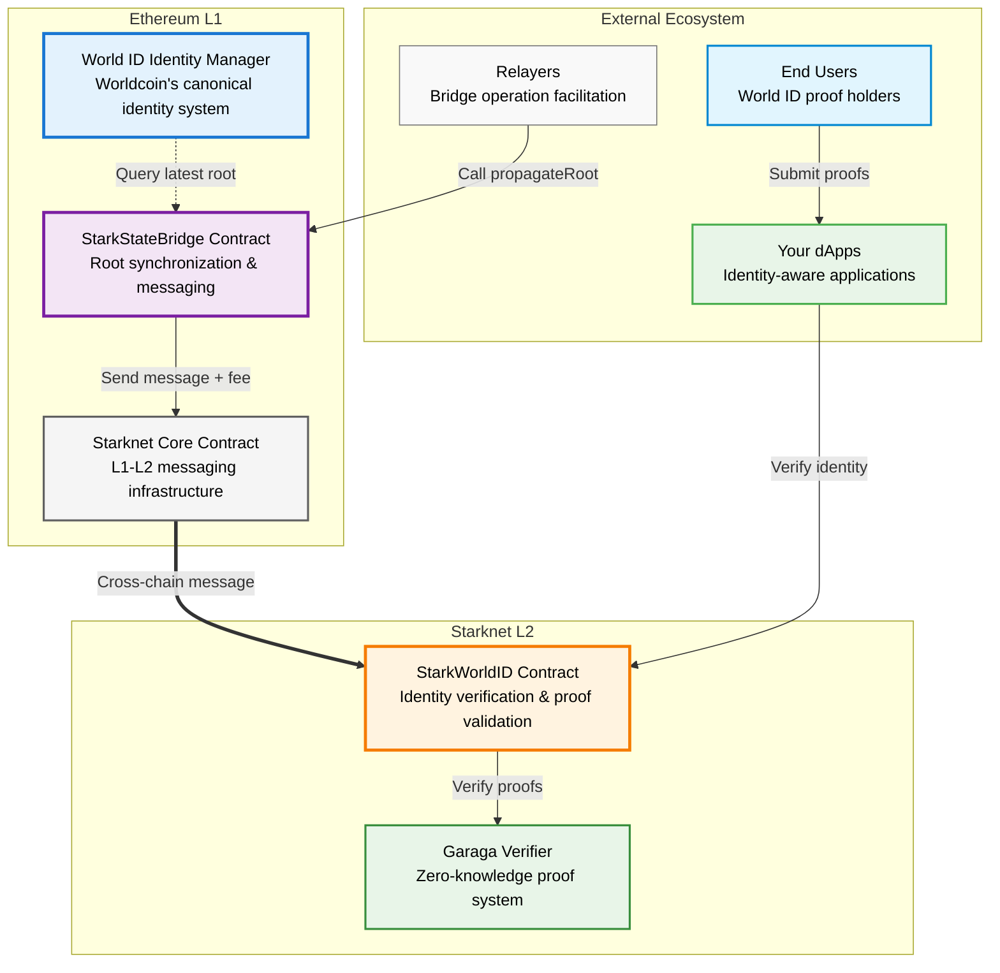
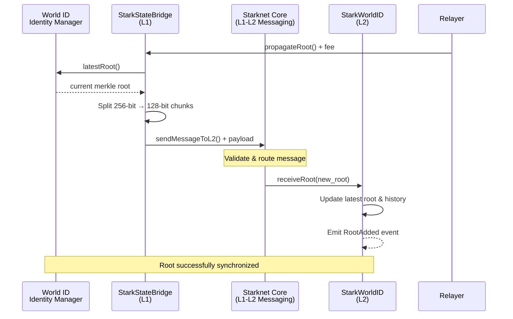
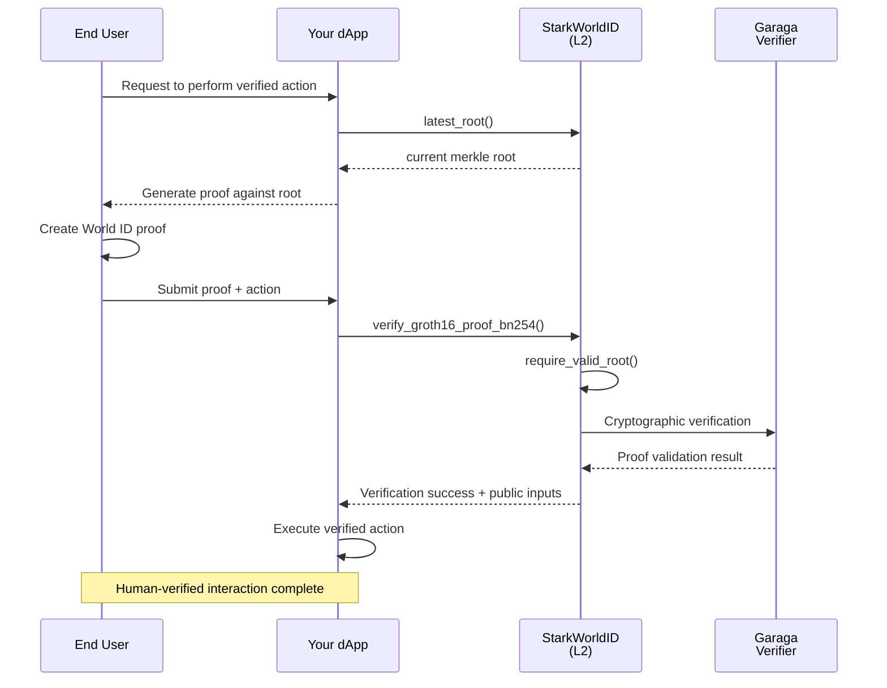

# System Overview

The World ID Bridge represents a sophisticated cross-chain infrastructure that extends Worldcoin's proof-of-personhood capabilities from Ethereum to Starknet's execution environment. This system creates a secure, efficient pathway for World ID's identity verification guarantees to operate natively within Starknet applications, enabling developers to build human-verified experiences while leveraging Starknet's computational advantages.

The bridge architecture implements a carefully orchestrated two-layer system: Ethereum serves as the canonical source of World ID state through direct integration with Worldcoin's Identity Manager, while Starknet provides the execution layer where applications can perform cost-effective identity verification through advanced zero-knowledge proof systems.

## Architecture Overview

## Core Components

### Ethereum Layer (L1)

The Ethereum layer establishes the foundational trust and synchronization mechanisms that ensure Starknet maintains cryptographic continuity with World ID's canonical state.

**[World ID Identity Manager](https://docs.worldcoin.org/)**: Worldcoin's authoritative identity management system serves as the single source of truth for global identity state. This contract maintains the canonical merkle tree of verified World ID commitments and provides the cryptographic foundation for all cross-chain identity operations.

**[StarkStateBridge Contract](/l1-components)**: The sophisticated bridging mechanism that orchestrates secure state transfer from Ethereum to Starknet. This contract queries the World ID Identity Manager for the latest merkle tree roots, implements comprehensive security validations, and leverages Starknet's native messaging infrastructure to ensure reliable cross-chain communication. The bridge maintains strict access controls for administrative functions while keeping core bridging operations permissionless, ensuring both security and operational resilience.

**Starknet Core Contract**: Starknet's official L1-L2 messaging infrastructure provides the cryptographic communication channel between chains. This production-grade system handles message authentication, fee collection, and reliable delivery guarantees that form the backbone of the bridge's cross-chain operations.

### Starknet Layer (L2)

The Starknet layer provides the execution environment where applications can efficiently verify World ID proofs while maintaining the same security guarantees as Ethereum-based verification.

**[StarkWorldID Contract](/l2-components)**: The authoritative identity verification system on Starknet that receives and validates World ID merkle tree roots from L1. This contract implements sophisticated temporal validation logic, maintains comprehensive root history for flexible proof verification, and provides the primary interface for applications to integrate World ID verification. The system combines secure cross-domain administration with openly accessible verification functions, enabling any application to leverage proof-of-personhood capabilities.

**Garaga Verifier Integration**: Advanced zero-knowledge proof verification system that enables native Groth16 proof validation directly on Starknet. This integration provides efficient cryptographic verification while maintaining compatibility with World ID's proof generation systems, ensuring seamless interoperability between chains.

## Data Flow and Synchronization

### Root Propagation Process

The synchronization process ensures that Starknet applications have access to the most current World ID state while maintaining strict security validations throughout the cross-chain communication pathway.

### Identity Verification Workflow

This workflow demonstrates how applications can seamlessly integrate World ID verification while maintaining excellent user experience and strong security guarantees.

## Security Architecture

### Cross-Chain Security Model

The bridge implements multiple layers of security protection that work in concert to maintain system integrity:

**Message Authentication**: All cross-chain communications utilize Starknet's cryptographically secured messaging protocol, ensuring that only legitimate messages from authorized L1 contracts can modify L2 state.

**Temporal Validation**: The L2 contract implements sophisticated root expiration logic that balances security considerations with user experience, preventing the use of stale identity commitments while maintaining reasonable proof validity windows.

**Economic Security**: Configurable fee limits protect against both accidental overspending during network congestion and potential economic attacks that could disrupt bridge operations.

**Administrative Controls**: Critical configuration functions maintain strict access controls while keeping core verification capabilities openly accessible, ensuring proper governance without compromising operational accessibility.

### Cryptographic Guarantees

The system preserves World ID's fundamental security properties across the cross-chain boundary:

- **Identity Uniqueness**: Each verified human can generate only one valid proof per application context
- **Anonymity**: Zero-knowledge proofs reveal no information about user identity beyond verification status
- **Non-Repudiation**: Cryptographic commitments prevent users from denying their verified actions
- **Freshness**: Temporal validation ensures proofs reflect current identity system state

## Integration Benefits

### For Developers

**Cost Efficiency**: Leverage Starknet's computational advantages for identity verification at a fraction of Ethereum mainnet costs, enabling new application models that were previously economically unfeasible.

**Native Integration**: Direct smart contract integration without external oracles or trusted intermediaries, providing immediate verification results within transaction execution.

**Flexible Architecture**: Support for both latest-root and historical-root verification patterns, accommodating different application requirements and user experience considerations.

**Comprehensive Tooling**: Complete event system and error handling provide robust foundations for building production-grade identity-aware applications.

### For End Users

**Seamless Experience**: Single World ID verification enables interaction with applications across both Ethereum and Starknet without additional identity setup or management overhead.

**Enhanced Privacy**: Zero-knowledge proof verification maintains user anonymity while providing strong identity guarantees to applications.

**Broad Accessibility**: Reduced transaction costs on Starknet make identity-verified interactions accessible to a wider global audience.

## Getting Started

### For Application Developers

Ready to integrate World ID into your Starknet application? Follow our comprehensive **[Getting Started Guide](/getting-started)** for step-by-step implementation instructions, including code examples and contract integration patterns.

**Development Path:**
1. **Quick Integration**: Follow the [Getting Started Guide](/getting-started) for immediate implementation with working code examples
2. **Understand the Architecture**: Review the [L1 Components](/l1-components) to understand how identity state flows from Ethereum
3. **Deep Dive Implementation**: Study the [L2 Components](/l2-components) for advanced integration patterns and monitoring
4. **Production Deployment**: Test thoroughly on testnets before mainnet deployment

---

*The World ID Bridge establishes a new paradigm for cross-chain identity verification, enabling developers to build the next generation of human-verified applications while maintaining the security, privacy, and decentralization principles that define the World ID protocol.*